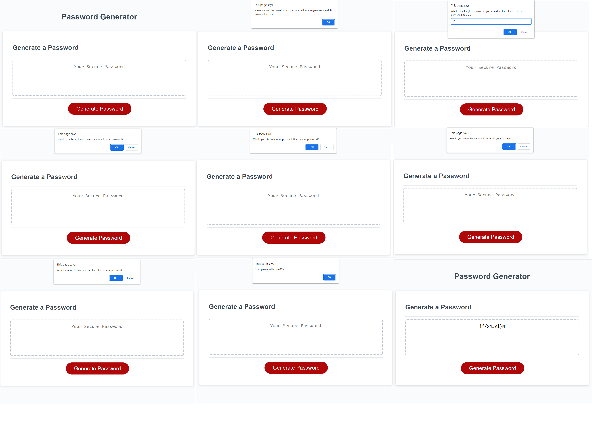

# Challenge 03-JavaScript: Password Generator

## Description

The challenge of this week is to modify starter code to create an application that enables users to generate random passwords based on criteria that they’ve selected. This app will run in the browser and powered by JavaScript code. 

## Credit

- UNB Coding Bootcamp: Class Materials  
(Especially the advice of the Bootcamp Instructor that to use console.log a lot.)
- Google Search Materials
- Discussion of people on https://stackoverflow.com/
- https://www.w3schools.com

## License

MIT License

## Completed Works - Link and Screenshot

- https://yelzaw.github.io/03-challenge-generate-password/

- Screenshot of webpage

